# <h1black>Section 4: Leverage Native Snowflake Features</h1blue>

**Duration:** TODO minutes

## <h1sub>Objective</h1sub>

Now that the Apache Spark code has been migrated to run on Snowpark Connect, let's show how to incorporate more Snowflake features into the project.

- Move the code into Snowflake Workspaces, Snowflake's built-in, native web IDE.
- Schedule the Notebooks using Snowflake Tasks, Snowflake's native orchestration product.
- 

---

## <h1sub>Task 1: Introduction to Snowflake Workspaces</h1sub>


### Step 1: Create a Shared Workspace

1. Go back to to the Snowflake UI and select **Projects** > **Workspaces**.

    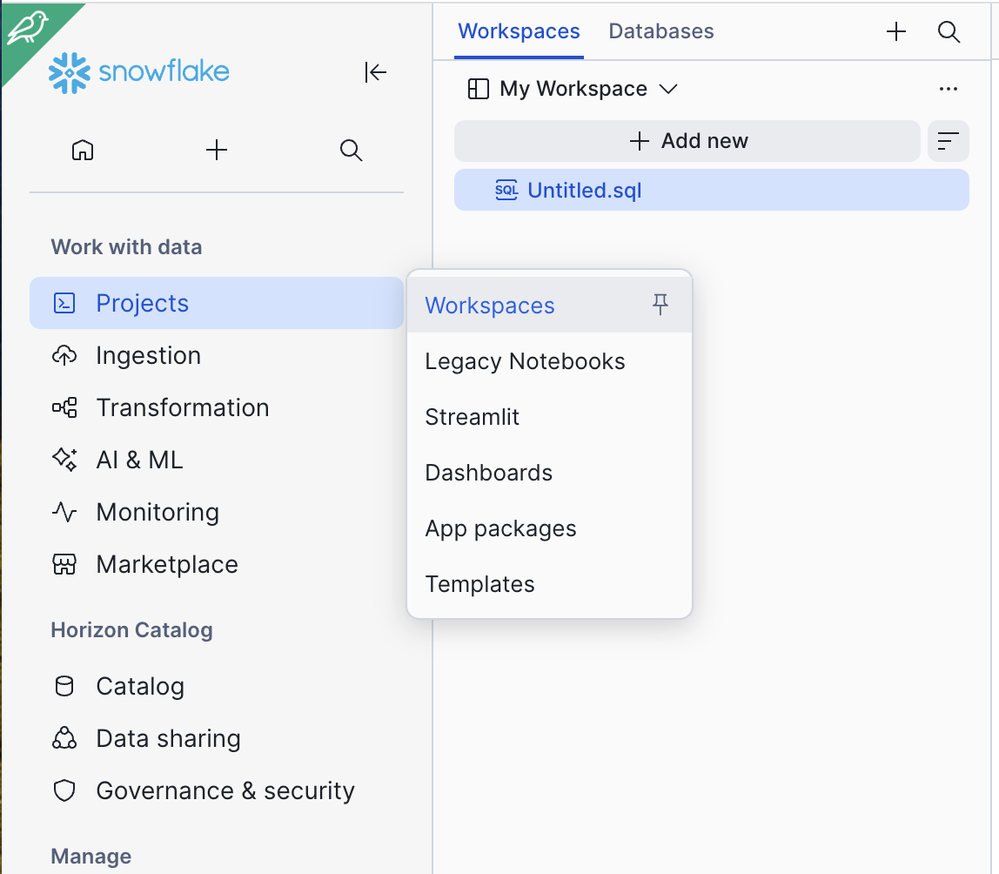

2. Click the **+** icon > Create new **Shared Workspace**.

    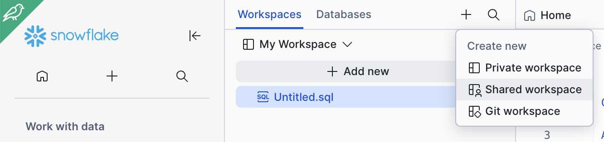

3. Set the name to **SPARK_WORKSPACE**, and create it in the **CORTEX_CODE_IDE_CONFIG.PUBLIC** database and schema. Share it with the **ACCOUNTADMIN** role.

    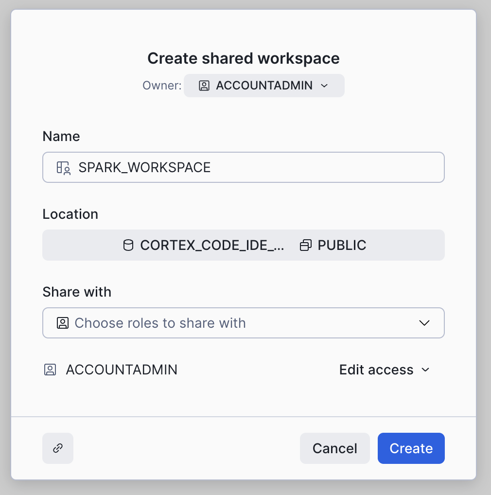

4. Let's get the full path of the Workspace location. Click the Workspace name, hover over the SPARK_WORKSPACE, and the location should show on the right. It should be: `CORTEX_CODE_IDE_CONFIG.PUBLIC.SPARK_WORKSPACE`.

    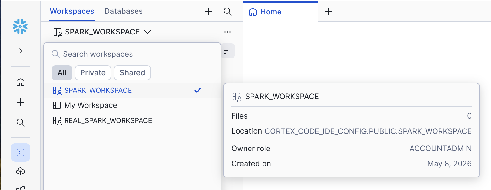

### Step 2: Copy files to the Workspace

1. Now switch back over to the VS Code browser tab. In the terminal, run the following command:

    ```bash
    snow sql -q "ALTER WORKSPACE CORTEX_CODE_IDE_CONFIG.PUBLIC.SPARK_WORKSPACE ADD LIVE VERSION FROM LAST;"
    ```

2. ... TODO: switch the upload path here

    ```bash
    snow sql -q "PUT 'file://test/file1.txt' 'snow://workspace/CORTEX_CODE_IDE_CONFIG.PUBLIC.SPARK_WORKSPACE/versions/live' AUTO_COMPRESS=false OVERWRITE=true";
    ```

3. ...

    ```bash
    snow sql -q "ALTER WORKSPACE CORTEX_CODE_IDE_CONFIG.PUBLIC.SPARK_WORKSPACE COMMIT;"
    ```

## <h1sub>Task 2: Edit with Snowflake Notebooks</h1sub>

### Step 1: Open the orchestrator Notebook

1. Now that the files are uploaded to the Workspace, go back to the Snowflake UI. You should see the files created there.

    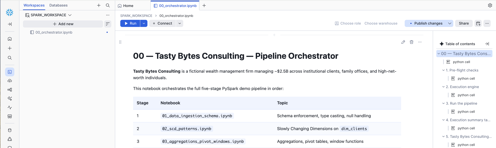

### Step 2: Connect the Notebook to Compute 

1. Click the **Connect** button next to the **Run** button.

1. In the popup window, select **CORTEX_CODE_IDE_EAI** under **External access integrations**. This will allow your Notebook to connect to PyPi.org to install Python packages. 

    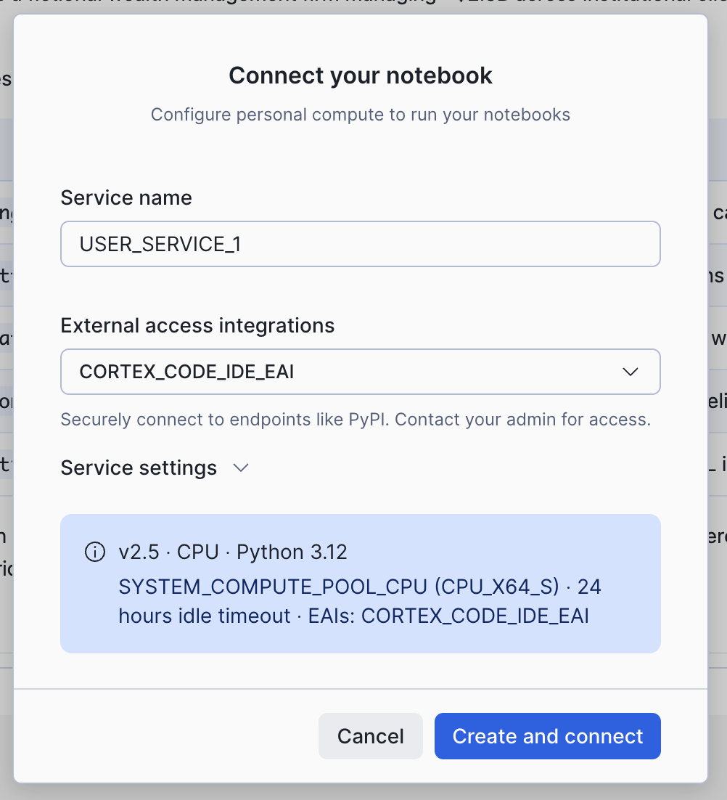

1. Click **Create and connect**. This will connect the Notebook to Snowflake's [Container Runtime](https://docs.snowflake.com/en/developer-guide/snowflake-ml/container-runtime-ml), an environment populated with packages and libraries that support a wide variety of development tasks inside Snowflake.

### Step 3: Develop in Snowflake Notebooks

Let's take a quick tour of Snowflake Notebooks!

1. You can run the Notebook end-to-end using the Run button at the top-left. You can also run it with Cortex code to automatically fix errors.

    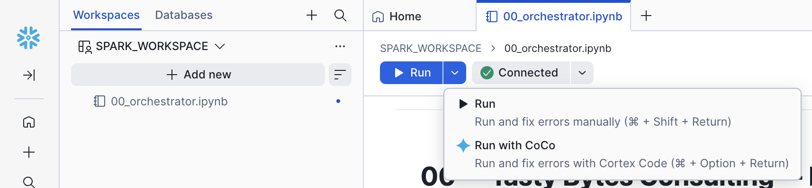

1. At the bottom of the page you can click the **Tools panel** to open the following tools:

    - Terminal: a bash terminal connected to the same environment as the Notebook
    - Scratchpad: a Python RePL conencted to the Python environment. Any variables in the Notebook can be accessed here.
    - Variables: an explorer of the Python variables declared from the Notebook
    - Dependency Graph: a visual representation of where variables and functions are used throughout the Notebook cells

1. The **Table of Contents** on the right shows all your cells, indented by Markdown header level.

    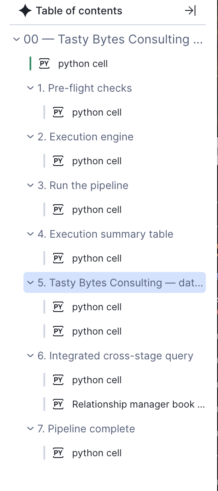

1. Try running the Orchestrator Notebook by clicking the **Run with CoCo** button at the top!

---

## <h1sub>Task 2: Orchestrate with Snowflake Tasks</h1sub>

[Snowflake Tasks](https://docs.snowflake.com/en/user-guide/tasks-intro) are a powerful way to automate data processing and to optimize business procedures on your data pipeline.

Let's schedule the Orchstrator Notebok to run every morning with Snowflake Tasks.

### Step 1: Publish Changes

Since we're developing in a shared Workspace, our changes have not yet been published to the latest version. Publishing our changes will make the edits available to other viewers of the Notebook, and more importantly, available to the Snowflake Task.

1. Click the **Publish Changes** button at the top right.

    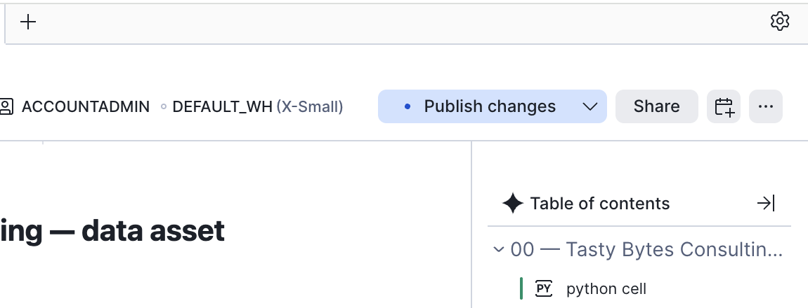

### Step 2: Schedule the Notebook

1. Click the Calendar icon at the top-right of the Notebook.

    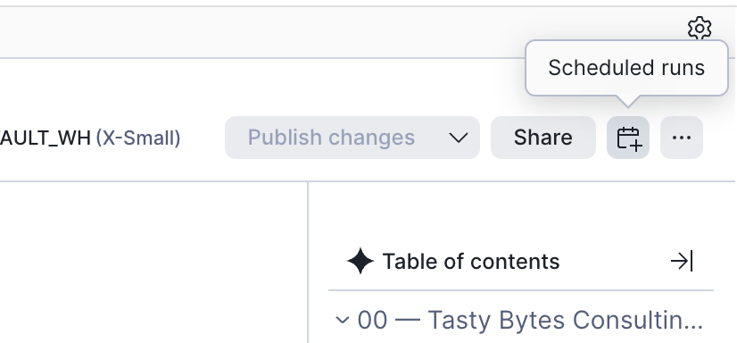

1. In the form, provide any name for the Snowflake Task, like "orchestrator_task". You will also need to select a Database and schema to create the Task in.

    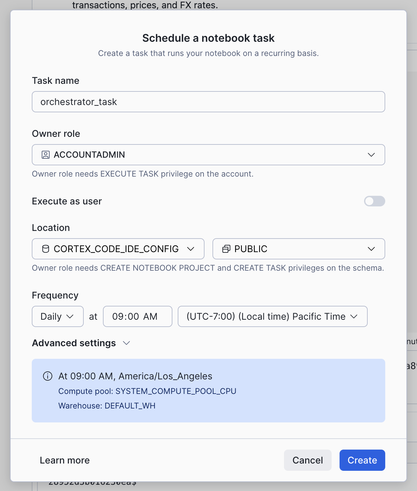

1. (Optional) Click **Advanced Settings** to see the other options available.

1. Click **Create**! Behind the scenes, this will create a Snowflake Task and a [Notebook Project Object](https://docs.snowflake.com/en/sql-reference/sql/execute-notebook-project). The resulting SQL definition will look something like this:

    ```SQL
    create or replace task CORTEX_CODE_IDE_CONFIG.PUBLIC."00_orchestrator_task_DFC33FED"
	warehouse=DEFAULT_WH
	schedule='USING CRON 0 9 * * * America/Los_Angeles'
	as EXECUTE NOTEBOOK PROJECT "CORTEX_CODE_IDE_CONFIG"."PUBLIC"."NOTEBOOK_PROJECT_69EA7C99"
        MAIN_FILE = '00_orchestrator.ipynb'
        COMPUTE_POOL = "SYSTEM_COMPUTE_POOL_CPU"
        RUNTIME = 'V2.5-CPU-PY3.12'
        QUERY_WAREHOUSE = "DEFAULT_WH"
        EXTERNAL_ACCESS_INTEGRATIONS = ( 'CORTEX_CODE_IDE_EAI' );
    ```

### Step 3: ...

---

## <h1sub>Validation Checklist</h1sub>

Before moving to Step 5, confirm:

- [ ] 
- [ ] 
- [ ] 

---

## <h1sub>Key Takeaways</h1sub>

1. ...
2. ...

---

## <h1sub>Next Steps</h1sub>

Proceed to [Step 5: TODO](step5.md) where you'll TODO
